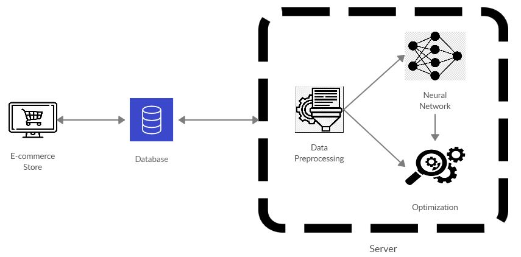

# Thesis
**Dynamic pricing of e-shop products through machine learning algorithms**

## Abstract
Dynamic pricing is a business strategy that periodically adjusts the prices of products or services offered by a company and aims to maximize its long-term profits. It works best in an environment where prices can be adjusted easily and frequently, such as e-commerce. The problem of dynamic pricing is not only about price optimization but also about better knowledge of the relationship between price and market response. This relationship is usually modeled through a demand function, which is based on several unknown factors, the values of which can be found by applying statistical estimation techniques to sales history data. This diploma thesis addresses the problem of dynamic pricing through machine learning. The essential value of machine learning algorithms is that they can generalize through experience. They can then accurately perform new and unknown prediction tasks after experiencing a set of learning data, such as historical sales data. Therefore, the use of machine learning techniques and algorithms is appropriate to address the problem of dynamic pricing.

This diploma thesis proposes a system for the dynamic pricing of products of an e-commerce store, through machine learning models. In this approach, real data are used and the evaluation of the proposed system is done in real time. The main purpose is to develop and present a methodology for solving the problem of dynamic pricing under realistic conditions.

<p align="right"> <i> Vasileios Dimitriadis <br>
Electrical and Computer Engineering <br>
Aristotle University of Thessaloniki, Greece <br>
December 2020
</i>
</p>

---

## Description

This project was implemented using real data from an e-commerce store. All the necessary data were saved to a database in which our program had access using mysql-connector. The credentials to connect to the database differ and general names are being used in order to protect the data. All the data had been processed in order to be functional and in the appropriate format.
<br><br>


A neural network is used in order to model the demand function of the products for each week. The neural network can be used after the training in order to predict the demand of each product for a week. The prices of the products are modified dynamically in order to maximize the gains for the week of the prediction. The optimization algorithm used for the maximization is particle swarm optimization.
<br><br><br>


---

## Dependencies

### Install TensorFlow
1. Download and install [Anaconda](https://www.anaconda.com/products/individual) or the smaller [Miniconda](https://docs.conda.io/en/latest/miniconda.html)
2. On Windows open the Start menu and open an Anaconda Command Prompt. On macOS or Linux open a terminal window. Use the default bash shell on macOS or Linux.
3. Choose a name for your TensorFlow environment, such as “tf”.
4. To install the current release of CPU-only TensorFlow:
```bash
conda create -n tf tensorflow
conda activate tf
```

### Install more packages inside TensorFlow environment (tf)
```bash
conda install pandas
conda install sqlalchemy
conda install dateparser
conda install matplotlib
pip install sklearn
pip install mysql-connector-python-rf
```
<br>

---

## Usage

- data.py:contains all the functions for data preprocessing
- neural_network.py: contains all the functions for testing and creating the neural network
- pso.py: contains all the necessary code for the particle swarm optimization
- main.py: shows the order in which our functions are being called.

The code written is not functional as there has to be a connection to a database which contains all the necessary data.
This code is for educational and demonstration purposes. The characteristics of the initial data are:

| Characteristic | Type | Description |
| --- | --- | --- |
| product_id | string | ID of the product |
| product_price | float | Price of the product |
| product_quantity | integer | Quantity of the product |
| customer_id | string | ID of the customer |
| order_id | string | ID of the order |
| order_timestamp | timestamp | Date of the order |
